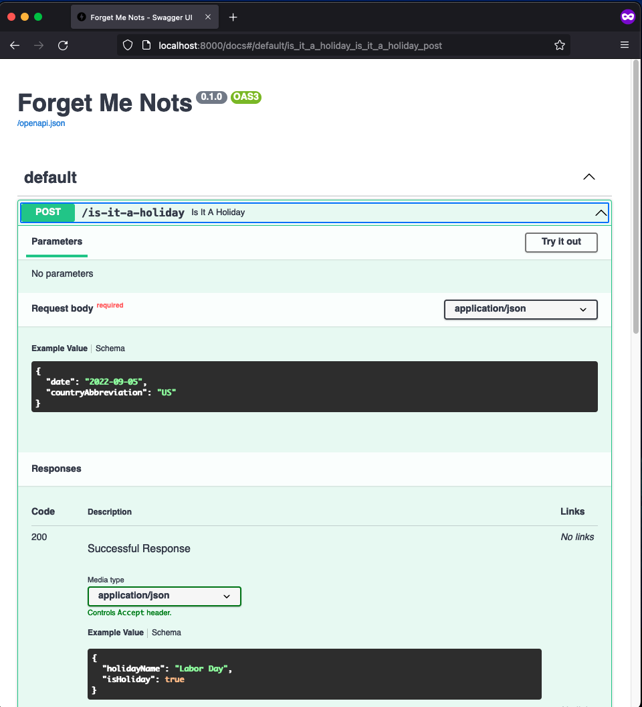
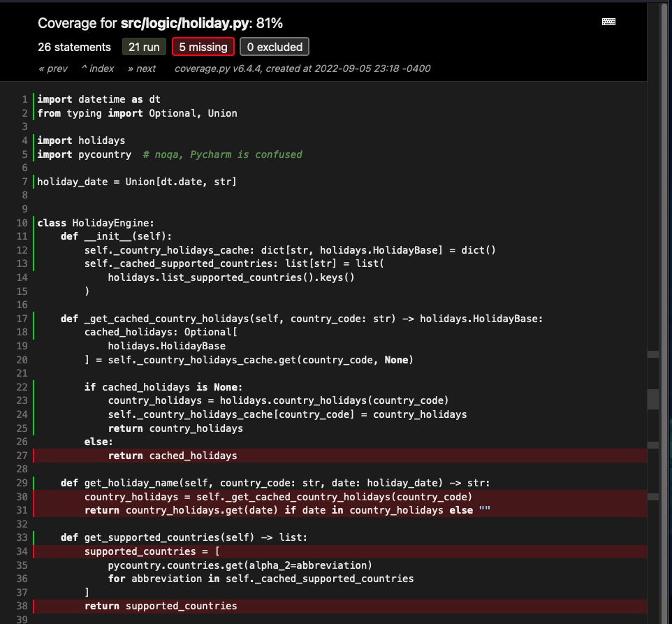

# Forget Me Nots

[](https://codecov.io/gh/ben-nathanson/forget-me-nots)

Forget Me Nots is an API for anything you would want to remember, including:
- Holidays

We're also looking at adding:
- TODO list
- Reminders

# Setup
- You're going to need
  - Python (3.11 at time of writing). I recommend `pyenv`.
  - `pip`
  - A valid Firebase config at `src/firebase-credentials.json`

# Firebase Configuration
Create a new application in [Firebase](https://firebase.google.com/).

You will need a Firebase API key as well as Firebase admin credentials. The JSON
configuration should resemble the following:

```JSON
{
    "api_key": "test_api_key",
    "auth_provider_x509_cert_url": "www.test.test",
    "auth_uri": "www.test.test",
    "client_email": "test@nathanson.dev",
    "client_id": "123456789123456789123",
    "client_x509_cert_url": "www.test.test",
    "private_key": "test_private_key",
    "private_key_id": "test-key-id",
    "project_id": "test-project-id-123",
    "token_uri": "www.test.test",
    "type": "service_account"
}
```

Save this config to `src/firebase_credentials.json`. For security, these credentials
should not be made publicly available.

# Running the Server Locally
Run `./run_server.sh`. You should see something like this:
```
...
INFO:     Will watch for changes in these directories: ['<redacted>/forget-me-nots']
INFO:     Uvicorn running on http://127.0.0.1:8000 (Press CTRL+C to quit)
INFO:     Started reloader process [27797] using StatReload
INFO:     Started server process [27801]
INFO:     Waiting for application startup.
INFO:     Application startup complete.
```

As you submit requests, you'll see them show up in real time:

```
INFO:     127.0.0.1:52892 - "GET /docs HTTP/1.1" 200 OK
INFO:     127.0.0.1:52892 - "GET /openapi.json HTTP/1.1" 200 OK
INFO:     127.0.0.1:52897 - "GET /docs HTTP/1.1" 200 OK
INFO:     127.0.0.1:52897 - "GET /openapi.json HTTP/1.1" 200 OK
INFO:     127.0.0.1:52904 - "POST /is-it-a-holiday HTTP/1.1" 200 OK
```

Use `^C` to kill the process:
```
^C
INFO:     Shutting down
INFO:     Waiting for application shutdown.
INFO:     Application shutdown complete.
INFO:     Finished server process [27801]
INFO:     Stopping reloader process [27797]
```

# Browsing the OpenAPI Documentation
Start the server and navigate to `localhost:8000/docs` in your browser:


# Running Tests
Run `./run_tests.sh`. You should see something like this:
```
...
test/logic/test_holiday_engine.py::test_get_cached_country_holidays_handles_cache_miss PASSED    [ 10%]
test/logic/test_holiday_engine.py::test_get_cached_country_holidays_handles_cache_hit PASSED     [ 20%]
...
============================================================================ 10 passed in 0.37s ========
```

# Browsing Test Coverage
Run `./run_coverage_browser.sh`. You should see something like this:


# Disclaimer

This project serves as more of an excuse for me to experiment with new tools and design
patterns as well as some old favorites (FastAPI, Python, etc.).

**I don't intend to deploy this and maintain it as a real production application.**
